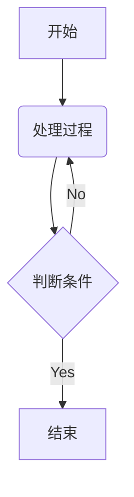
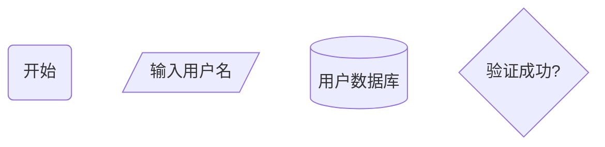
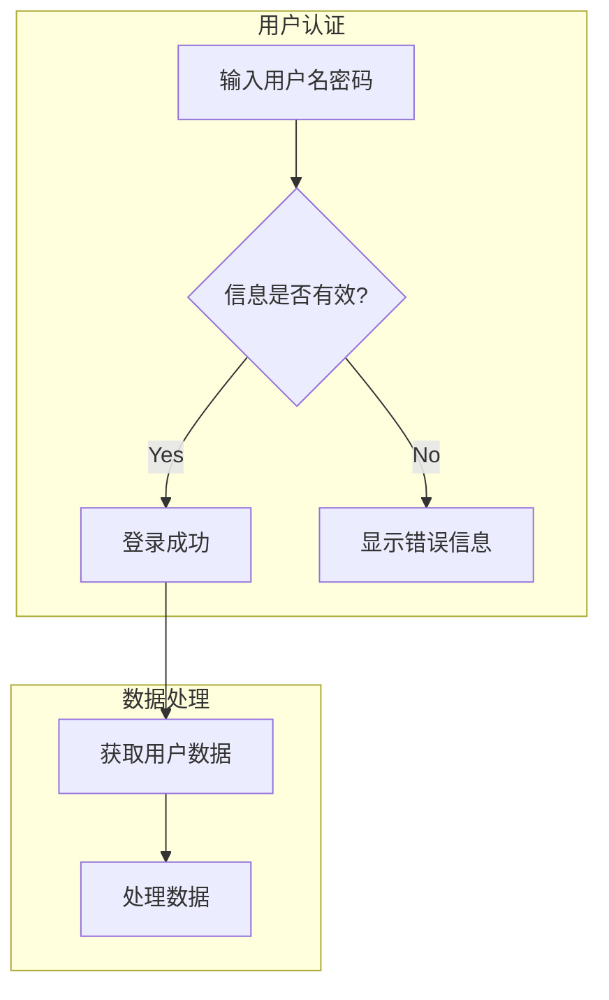
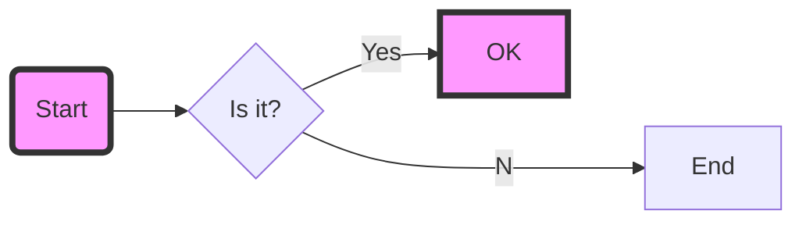
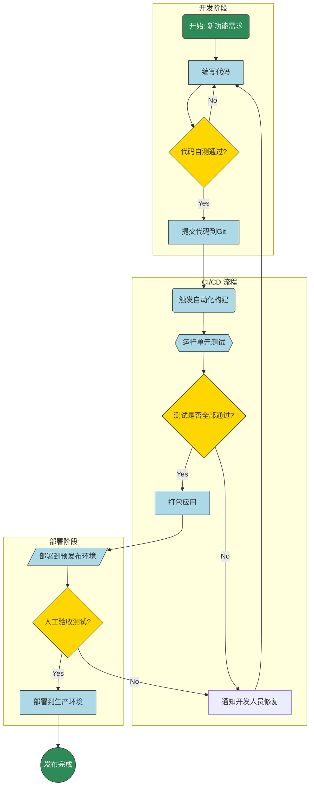

# flowchart
 > 流程图

### 基础流程图

一个最简单的流程图包含节点（Nodes）和连接它们的链接（Links）。

#### Markdown 代码

#### 渲染效果预览

这会生成一个流程图，其中：
*   图表方向为从上到下（`TD` - Top Down）。
*   `A` 是一个名为 "开始" 的矩形节点。
*   `B` 是一个名为 "处理过程" 的圆角矩形节点。
*   `C` 是一个名为 "判断条件" 的菱形（决策）节点。
*   从 `C` 出发有两条路径，分别标记为 "Yes" 和 "No"。
*   "No" 路径会返回到 `B`，形成一个循环。
*   "Yes" 路径会到达名为 "结束" 的矩形节点 `D`。

### 语法详解

#### 1. 声明图表类型和方向

*   **`flowchart`** 或 **`graph`**: 必须是 `mermaid` 代码块的第一行，声明这是一个流程图。`graph` 是 `flowchart` 的别名。
*   **方向**:
    *   `TD` 或 `TB`: 从上到下 (Top Down / Top to Bottom)
    *   `LR`: 从左到右 (Left to Right)
    *   `RL`: 从右到左 (Right to Left)
    *   `BT`: 从下到上 (Bottom to Top)

**示例**: `flowchart LR` 将使流程图从左向右布局。

#### 2. 定义节点 (Nodes)

节点的语法是 `id[文本]`，其中 `id` 是节点的唯一标识符（在代码中使用），`文本` 是图表中显示的文字。

你可以定义不同形状的节点：

| 形状             | 语法示例              | 描述                     |
| :--------------- | :-------------------- | :----------------------- |
| **矩形**         | `id[文本]`            | 用于表示一个过程或步骤   |
| **圆角矩形**     | `id(文本)`            | 通常用于表示开始或结束   |
| **圆形**         | `id((文本))`          | 通常用于表示连接点或小步骤 |
| **菱形 (决策)**  | `id{文本}`            | 用于表示需要判断的条件   |
| **平行四边形**   | `id[/文本/]`          | 用于表示输入/输出 (I/O)  |
| **反向平行四边形** | `id[\文本\]`          |                          |
| **梯形**         | `id[/文本\]`          | 用于表示手动操作         |
| **六边形**       | `id{{文本}}`          | 用于表示准备步骤         |
| **圆柱形 (数据库)** | `id[(文本)]`          | 用于表示数据存储         |

**示例**:

#### 3. 定义链接 (Links / Arrows)

链接用于连接节点，并可以带有文本。

| 链接样式         | 语法示例                  | 描述                     |
| :--------------- | :------------------------ | :----------------------- |
| **带箭头实线**   | `A --> B`                 | 最常用的连接线           |
| **无箭头实线**   | `A --- B`                 | 表示无方向的连接         |
| **带文本的链接** | `A --文本--> B` 或 `A -->|文本| B` | 在连接线上显示文本       |
| **虚线链接**     | `A -.-> B`                | 表示弱关系或异步操作     |
| **带文本的虚线** | `A -.文本.-> B`           |                          |
| **粗线链接**     | `A ==> B`                 | 用于强调重要的流程       |

**链接链 (Chaining)**:
你可以将多个链接串联起来，使代码更简洁。
`A --> B --> C --> D`

**连接到多个节点**:
`A --> B & C` 等同于 `A --> B` 和 `A --> C` 两行代码。

### 高级功能

#### 4. 子图 (Subgraphs)

当流程图变得复杂时，可以使用子图将相关的节点分组。

这会创建两个名为 "用户认证" 和 "数据处理" 的方框，分别包含各自的节点。

#### 5. 样式和类 (Styling and Classes)

你可以为节点定义 CSS 样式，以自定义其外观（颜色、边框等）。

这会将 `id1` 和 `id3` 节点的背景色变为粉色，并添加粗黑边框。

### 综合示例：一个网站发布流程

这个例子结合了多种语法，展示了一个相对完整的流程。

这个例子展示了：
*   **子图**：将流程分为开发、CI/CD 和部署三个阶段。
*   **不同节点形状**：圆角矩形、矩形、菱形和圆形。
*   **决策和循环**：代码自测和单元测试都有失败后返回的路径。
*   **样式**：为不同类型的节点（开始/结束、过程、决策）定义了不同的颜色，使图表更具可读性。

希望这份详细的介绍能帮助你轻松地在 Markdown 中创建和使用流程图！