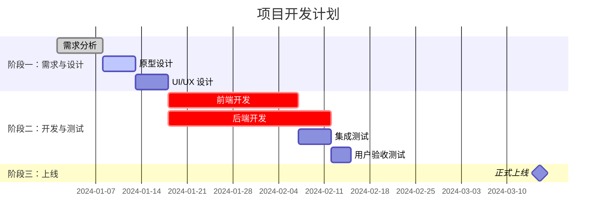
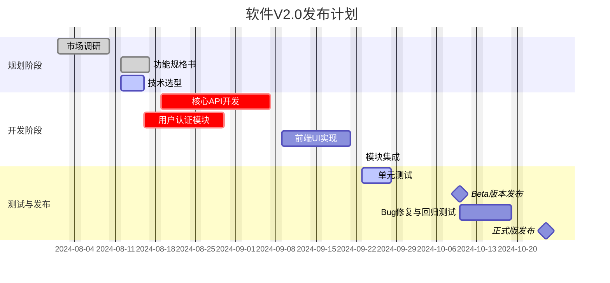

# gantt
> 甘特图

### 基础甘特图示例

#### Markdown 代码




#### 渲染效果预览

上面的代码会渲染成一个可视化的甘特图，大致如下：

*   **标题** 为 "项目开发计划"。
*   **时间轴** 以 "年-月-日" 格式显示。
*   **三个阶段（Section）**：需求与设计、开发与测试、上线。
*   **多个任务**：
    *   `需求分析` 已完成（`done`），显示为灰色或有填充。
    *   `原型设计` 正在进行中（`active`），显示为不同颜色（如蓝色）。
    *   `前端开发` 和 `后端开发` 是关键任务（`crit`），通常会用红色突出显示。
    *   `正式上线` 是一个里程碑（`milestone`），通常显示为菱形。


### 语法详解

下面是对甘特图语法的详细解释：

1.  **声明图表类型**:
    *   `gantt`: 必须在 `mermaid` 代码块的第一行，告诉渲染器这是一个甘特图。

2.  **图表标题**:
    *   `title 你的标题`: 设置甘特图的整体标题。

3.  **日期格式**:
    *   `dateFormat YYYY-MM-DD`: 定义输入日期的格式。支持多种格式，如 `YYYY-MM-DD`, `MM-DD`, `YYYY/MM/DD` 等。

4.  **排除日期/周末 (可选)**:
    *   `excludes weekends`: 在计算任务时长时会自动跳过周六和周日。
    *   `excludes 2024-02-10, 2024-02-11`: 排除特定日期。

5.  **分区/阶段 (Section)**:
    *   `section 阶段名称`: 用于将任务分组，使图表结构更清晰。

6.  **定义任务**:
    *   语法格式：`任务名称 :[状态], [ID], [起始时间], [持续时间/结束时间]`

    *   **任务名称**: 显示在图表左侧的文本。
    *   **状态 (可选)**:
        *   `done`: 已完成。
        *   `active`: 进行中。
        *   `crit`: 关键任务 (critical)。
        *   留空: 未开始的普通任务。
    *   **ID (可选但推荐)**: 任务的唯一标识符，用于任务依赖。例如 `des1`, `dev2`。
    *   **起始时间**:
        *   绝对日期: `2024-01-01`
        *   相对日期: `after id1, id2` (表示在前一个或多个任务结束后开始)。
    *   **持续时间/结束时间**:
        *   持续时间: `5d` (5天), `2w` (2周), `3h` (3小时)。
        *   结束日期: `2024-01-10`。

7.  **定义里程碑 (Milestone)**:
    *   里程碑是一个没有持续时间的瞬间事件。
    *   语法：`里程碑名称 :milestone, [ID], [日期], 0d`
    *   例如：`正式上线 :milestone, launch, 2024-03-15, 0d`


### 更复杂的示例

这个例子展示了更复杂的依赖关系和注释。

#### Markdown 代码



### 在你的工具中使用

1.  **GitHub/GitLab**: 直接在 `.md` 文件或评论区中粘贴上面的 ` ```mermaid ... ``` ` 代码块即可。
2.  **Typora**: 在偏好设置中启用 Mermaid 功能，然后正常输入代码块。
3.  **Obsidian**: 默认支持，直接使用代码块。
4.  **VS Code**: 安装 "Markdown Preview Mermaid Support" 或类似的插件，即可在 Markdown 预览中看到渲染效果。