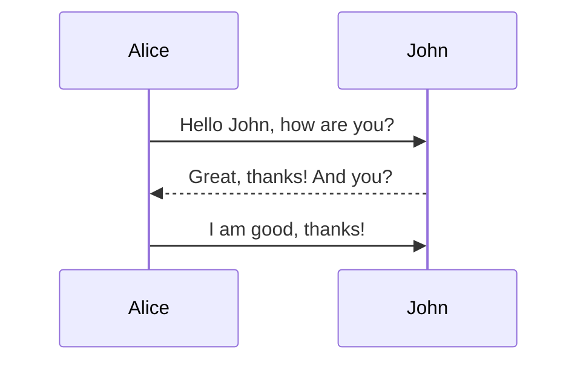
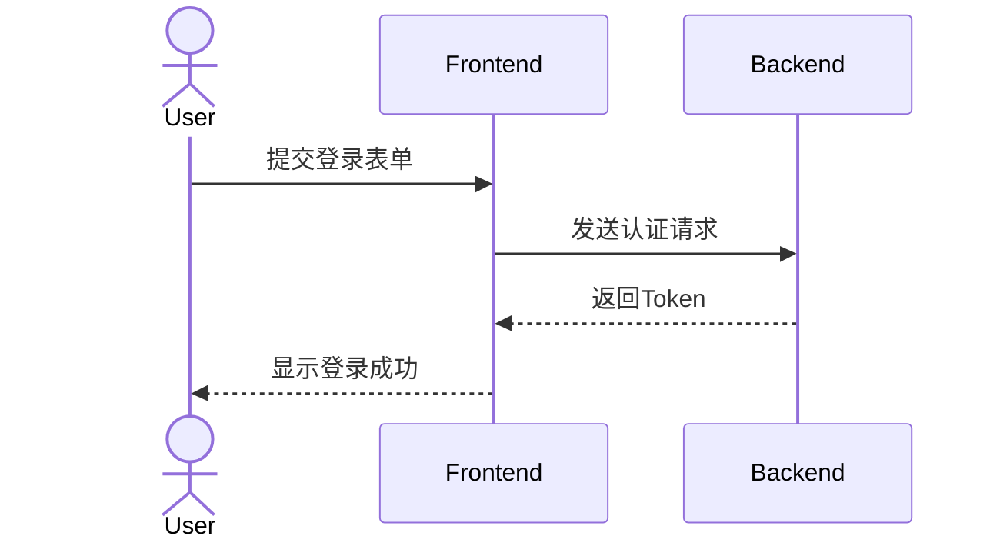
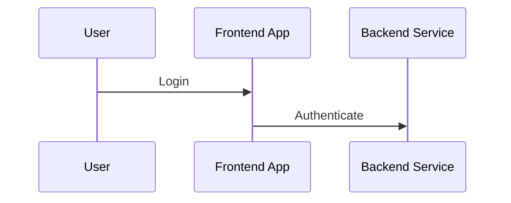
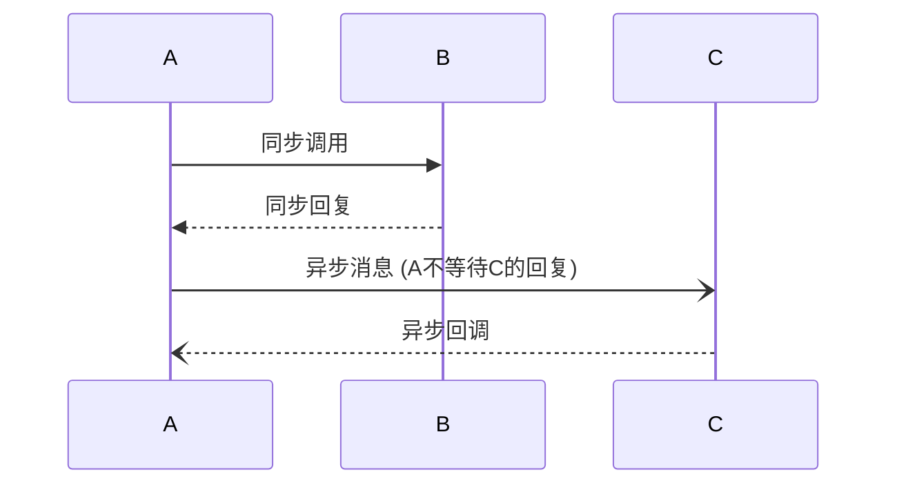
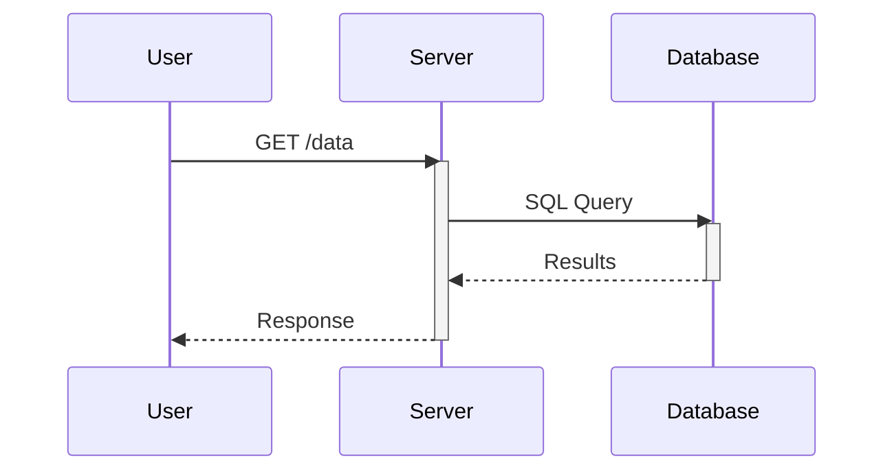
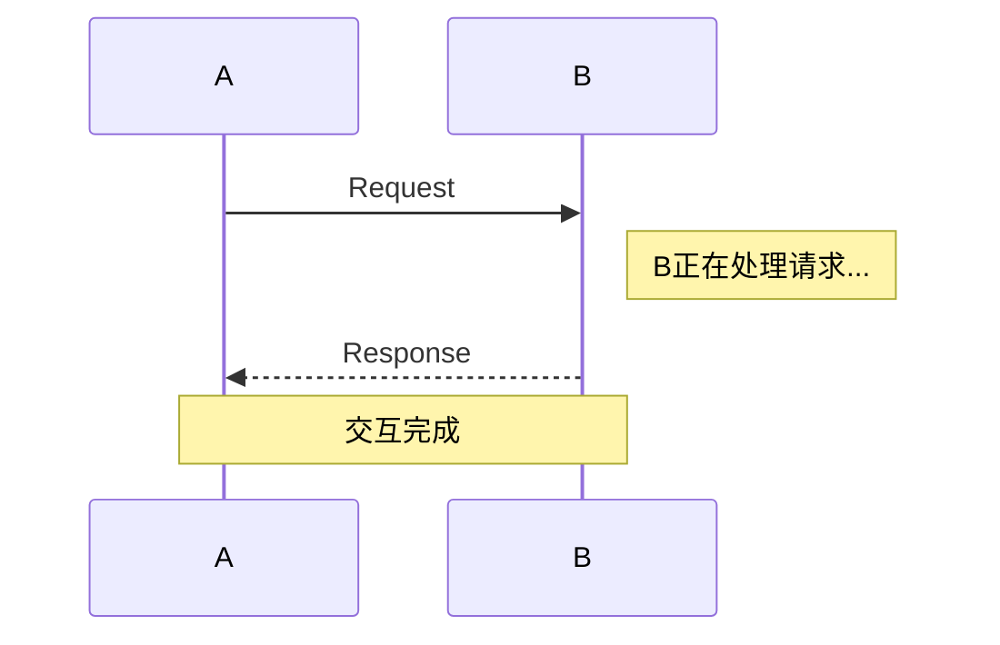
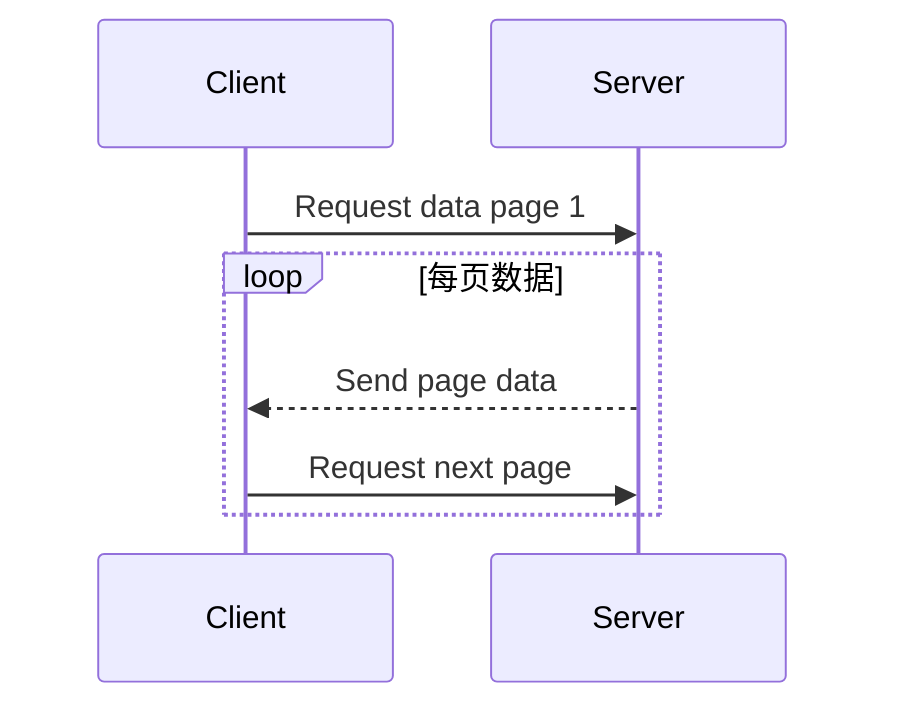
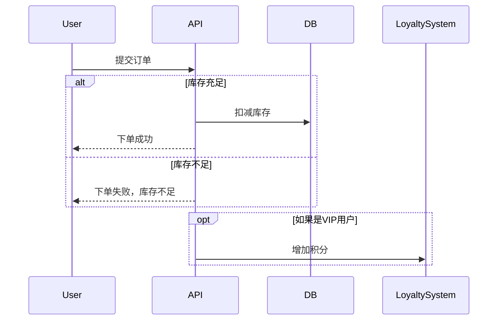
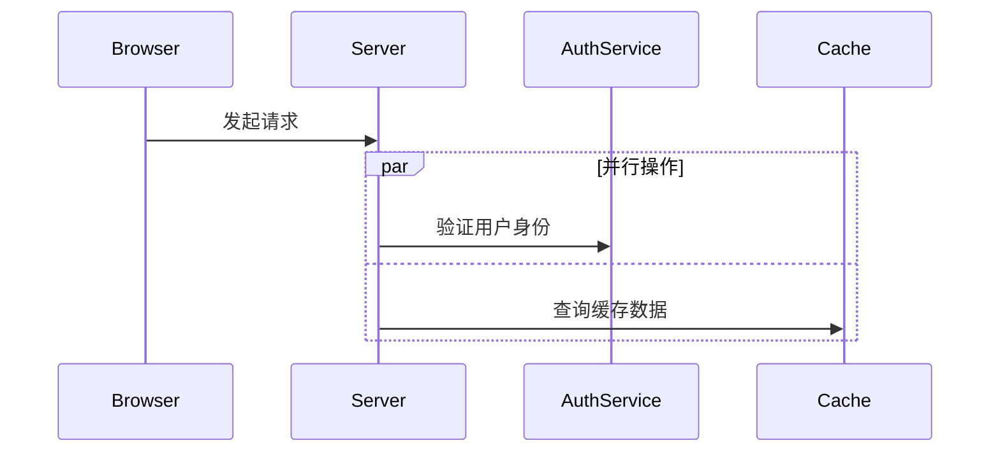
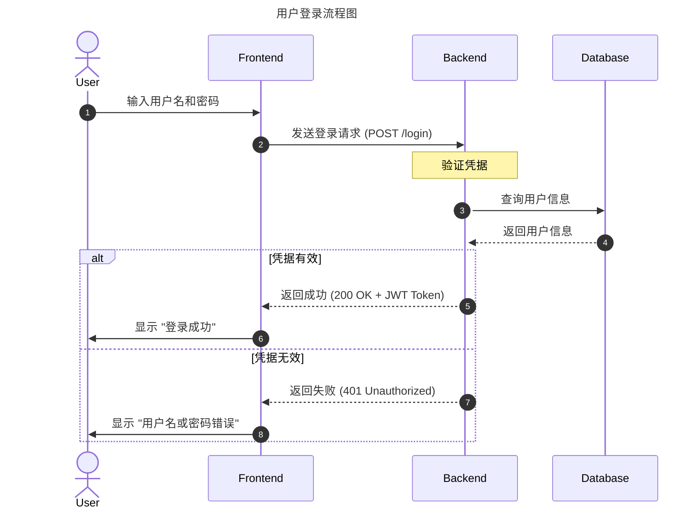

# Sequence Diagram 
 > 时序图

### 基础序列图

一个最简单的序列图包含参与者（Participants）和他们之间传递的消息（Messages）。

#### Markdown 代码

#### 渲染效果预览

这会生成一个简单的图，其中：
*   `Alice` 和 `John` 是两个参与者。
*   `->>` 表示一个实线的、带箭头的消息（同步消息）。
*   `-->>` 表示一个虚线的、带箭头的消息（通常用于回复）。
*   冒号 `:` 后面是消息的内容。

### 语法详解

#### 1. 声明图表类型

*   `sequenceDiagram`: 必须是 `mermaid` 代码块的第一行，定义图表类型为序列图。

#### 2. 定义参与者 (Participants)

参与者是交互的主体。Mermaid 会根据消息的流向自动创建参与者。但你也可以显式声明它们，这有助于设置别名或使用特定类型的参与者。

*   **`participant`**: 普通参与者，通常表示一个系统、组件或对象。
*   **`actor`**: 参与者的一种特殊类型，通常用来表示用户，会显示为一个“小人”图标。

你还可以为参与者设置别名，这在参与者名称很长时非常有用：

#### 3. 消息箭头类型

箭头的样式决定了消息的类型（同步、异步、回复等）。

| 箭头样式 | 含义                               |
| :------- | :--------------------------------- |
| `->`     | 实线，无箭头（不常用）             |
| `-->`    | 虚线，无箭头（不常用）             |
| `->>`    | 实线，带实心箭头（**同步消息**）   |
| `-->>`   | 虚线，带实心箭头（**回复消息**）   |
| `-)`     | 实线，带开放箭头（**异步消息**）   |
| `--)`    | 虚线，带开放箭头（异步回复）       |
| `-x`     | 实线，带叉号箭头（**丢失的消息**） |
| `--x`    | 虚线，带叉号箭头（丢失的回复）     |

**示例：**

#### 4. 生命线激活 (Activation)

当你希望明确表示一个参与者在某个时间段内处于“活动”状态（例如，正在处理一个请求），可以使用 `activate` 和 `deactivate`。

这会在 `Server` 和 `Database` 的生命线上绘制出矩形框，表示它们正在工作的状态。

### 高级功能

#### 5. 注释 (Notes)

你可以在图表中添加注释来提供额外的上下文信息。

*   `Note right of [参与者]: 注释内容`
*   `Note left of [参与者]: 注释内容`
*   `Note over [参与者1],[参与者2]: 跨越多个参与者的注释`

#### 6. 循环 (Loops)

使用 `loop` 块来表示重复性的交互。

#### 7. 条件判断 (Alternatives & Optional)

*   **`alt/else`**: 用于表示“如果...否则...”的逻辑分支。
*   **`opt`**: 用于表示一个可选的交互流程。

#### 8. 并行处理 (Parallel)

使用 `par` 块来表示同时发生的操作。

---

### 综合示例：用户登录流程

这个例子结合了多种语法，展示了一个完整的用户登录交互过程。

这个例子中：
*   `title`: 设置了图表的标题。
*   `autonumber`: 自动为每条消息添加序号。
*   结合了 `actor`, `participant`, `activate/deactivate`, 和 `alt/else`。